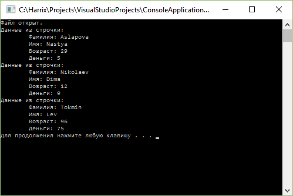
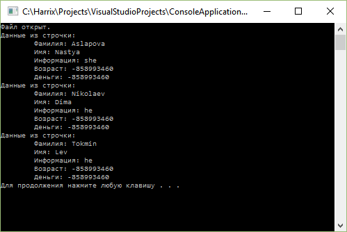
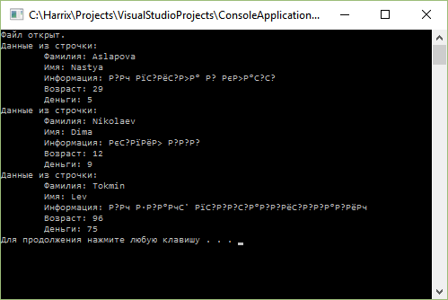
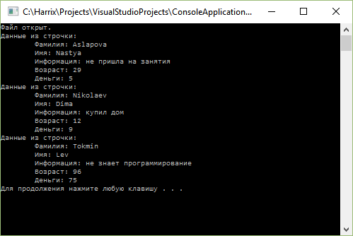
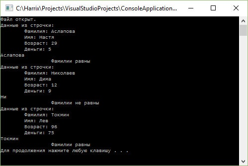

# Считывание табличных данных из файла на C++


Обучающий пример по работе с файлами в классическом C++. В качестве среды для разработки использовал Visual Studio 2015.

<details>
<summary>📖 Содержание</summary>

- [Первый случай](#первый-случай)
- [Второй случай](#второй-случай)
- [Третий случай](#третий-случай)
- [Четвертый случай](#четвертый-случай)

</details>

## Первый случай

У на есть файл `input.txt` с таким содержимым:

```text
Aslapova  Nastya  29  5
Nikolaev  Dima  12  9
Tokmin  Lev  96  75
```

То есть у нас тут хранится таблица с двумя столбцами, где хранятся строковые значения, и два столбца с целыми числами. Элементы разделены знаками табуляции. Количество строчек не известно.

Необходимо считать данные из файла и вывести на экран. При этом текстовые данные должны храниться в переменных типа `string`, а числа в переменных типа `int`.

Ниже приведен код программы, которая решает данную задачу. Обратите внимание на то, что тут используется подход по работе с потоками. Потоки может быть связаны не только с файлами или консолью, но также и со строчками:

```cpp
// Содержимое файла input.txt
/*
Aslapova  Nastya  29  5
Nikolaev  Dima  12  9
Tokmin  Lev  96  75
*/

// #include "stdafx.h" // Visual Studio может попросить

#include <iostream>
#include <fstream>
#include <string>
#include <sstream>

using namespace std;

int main()
{
  setlocale(LC_ALL, "RUSSIAN"); // Чтобы русский текст поддерживался

  // Создаем файловый поток и связываем его с файлом
  ifstream file("input.txt");

  if (file.is_open()) // Если открытие файла прошло успешно
  {
    cout << "Файл открыт." << endl;

    string line; // Строчка текста

    // Будем считывать информацию построчно до тех пор,
    // пока не закончится файл

    while (getline(file, line))
    {
      //cout << line << endl; // Можно посмотреть, что в строчке считалось

      // Теперь в line хранится содержимое строчки из файла.
      // Будем её разбирать на составные части.

      // В нашем файле идут две строчки, а потом два числа
      string name, surname;
      int age, money;

      // Создадим поток для считывания данных из строчки
      istringstream iss(line);

      // Теперь через стандартный оператор >> считаем данные
      // Программа сама поймет, что в качестве разделителя надо
      // использовать знак табуляции \t

      // За раз всё считаем
      iss >> surname >> name >> age >> money;

      // Выведем наши данные
      cout << "Данные из строчки:" << endl;
      cout << "\tФамилия: " << surname << endl;
      cout << "\tИмя: " << name << endl;
      cout << "\tВозраст: " << age << endl;
      cout << "\tДеньги: " << money << endl;
    }
  }
  else
  {
    cout << "Не удалось открыть файл." << endl;
  }

  system("pause");
    return 0;
}
```

При старте программы получим такую картину:



_Рисунок 1 — Результат выполнения программы_

Для простого случая такая программа подойдет.

## Второй случай

Рассмотрим более сложный случай. Допустим есть еще один столбец с текстовой информацией, но с наличием пробелов:

```text
Aslapova  Nastya  she did not come to class  29  5
Nikolaev  Dima  he bought a house  12  9
Tokmin  Lev  he does not know programming  96  75
```

Если мы напишем подобную программу, где только добавим новую `string` переменную `info`, то программа не будет работать, как нам нужно.

<details>
<summary>Неработающий код</summary>

Код:

```cpp
// Содержимое файла input.txt
/*
Aslapova  Nastya  she did not come to class  29  5
Nikolaev  Dima  he bought a house  12  9
Tokmin  Lev  he does not know programming  96  75
*/

//#include "stdafx.h" // Visual Studio может попросить

#include <iostream>
#include <fstream>
#include <string>
#include <sstream>

using namespace std;

int main()
{
  setlocale(LC_ALL, "RUSSIAN"); // Чтобы русский текст поддерживался

  // Создаем файловый поток и связываем его с файлом
  ifstream file("input.txt");

  if (file.is_open()) // Если открытие файла прошло успешно
  {
    cout << "Файл открыт." << endl;

    string line; // Строчка текста

    // Будем считывать информацию построчно до тех пор,
    // пока не закончится файл

    while (getline(file, line))
    {
      //cout << line << endl; // Можно посмотреть, что в строчке считалось

      // Теперь в line хранится содержимое строчки из файла.
      // Будем её разбирать на составные части.

      // В нашем файле идут две строчки, а потом два числа
      string name, surname, info;
      int age, money;

      // Создадим поток для считывания данных из строчки
      istringstream iss(line);

      // Теперь через стандартный оператор >> считаем данные
      // Программа сама поймет, что в качестве разделителя надо
      // использовать знак табуляции \t

      // За раз всё считаем
      iss >> surname >> name >> info >> age >> money;

      // Выведем наши данные
      cout << "Данные из строчки:" << endl;
      cout << "\tФамилия: " << surname << endl;
      cout << "\tИмя: " << name << endl;
      cout << "\tИнформация: " << name << endl;
      cout << "\tВозраст: " << age << endl;
      cout << "\tДеньги: " << money << endl;
    }
  }
  else
  {
    cout << "Не удалось открыть файл." << endl;
  }

  system("pause");
    return 0;
}:

```

</details>

Вот, что получим:



_Рисунок 2 — Результат неработающей программы_

Почему программа не работает:

```cpp
iss >> surname >> name >> info >> age >> money;
```

Когда мы в потоке считывали наши данные, то программ не делает разницы между знаком табуляции и знаком пробела в качестве знака разделителя. Поэтому, когда считывается переменная `info`, то считывается значение до знака пробела, а не до знака табуляции. Отсюда и ошибки.

Как быть? Посмотрим эту строку:

```cpp
iss >> surname >> name >> info >> age >> money;
```

Её бы заменить на цикл, в котором из нашего потока `iss` будем вытаскивать строчки используя в качестве разделителя то, что там нужно. Будем использовать подобную конструкцию:

```cpp
string token;
while (getline(iss, token, '\t')) {
  std::cout << token << '\n';
}
```

Нам нужно будет только считанные значения в нужные переменные запихать. Еще не забыть перевести строчки в числа в нужных местах. Итого, полный код будет выглядеть так:

```cpp
// Содержимое файла input.txt
/*
Aslapova  Nastya  she did not come to class  29  5
Nikolaev  Dima  he bought a house  12  9
Tokmin  Lev  he does not know programming  96  75
*/

//#include "stdafx.h" // Visual Studio может попросить

#include <iostream>
#include <fstream>
#include <string>
#include <sstream>

using namespace std;

int main()
{
  setlocale(LC_ALL, "RUSSIAN"); // Чтобы русский текст поддерживался

  // Создаем файловый поток и связываем его с файлом
  ifstream file("input.txt");

  if (file.is_open())//Если открытие файла прошло успешно
  {
    cout << "Файл открыт." << endl;

    string line;//Строчка текста

    // Будем считывать информацию построчно до тех пор,
    // пока не закончится файл

    while (getline(file, line))
    {
      //cout << line << endl; // Можно посмотреть, что в строчке считалось

      // Теперь в line хранится содержимое строчки из файла.
      // Будем её разбирать на составные части.

      // В нашем файле идут две строчки, а потом два числа
      string name, surname, info;
      int age, money;

      // Создадим поток для считывания данных из строчки
      istringstream iss(line);

      string token;
      int i = 0;
      while (getline(iss, token, '\t')) {
        if (i == 0) surname = token;
        if (i == 1) name = token;
        if (i == 2) info = token;
        if (i == 3) age = atoi(token.c_str()); // Перевод string в int
        if (i == 4) money = atoi(token.c_str()); // Перевод string в int
        i++;
      }

      // Выведем наши данные
      cout << "Данные из строчки:" << endl;
      cout << "\tФамилия: " << surname << endl;
      cout << "\tИмя: " << name << endl;
      cout << "\tИнформация: " << info << endl;
      cout << "\tВозраст: " << age << endl;
      cout << "\tДеньги: " << money << endl;
    }
  }
  else
  {
    cout << "Не удалось открыть файл." << endl;
  }

  system("pause");
    return 0;
}
```

При запуске программы получим следующее:


_Рисунок 3 — Результат выполнения программы_

## Третий случай

А что будет, если информация из третьего столбца у нас будет написана русскими буквами? Например, дан такой текст:

```text
Aslapova  Nastya  не пришла в класс  29  5
Nikolaev  Dima  купил дом  12  9
Tokmin  Lev  не знает программирование  96  75
```

Получится не то, что мы хотели:



_Рисунок 4 — Результат работы программы с русским текстом_

Тип `string` не умеет работать с `Unicode` кодировкой, в которой у нас сохранен текст файла. Как никак C++ появился и развился до внедрения Unicode.

Для этих нужд есть тип `wstring`. А для него многие вещи в программе придется поменять. Например, вместо `cout` теперь нужно использовать `wcout`, вместо `istringstream` будем использовать `wistringstream`, перед строчками, которые хотим вывести придется писать `L` и так далее.

Но и с `wstring` не всё гладко. Чтобы UTF-8 кодировка заработала, придется пошаманить. Именно по этой причине я не люблю работать с файлами и строками с помощью стандартных средств C++. Лучше использовать те типы переменных, которые есть в той среде, в которой пишется программа. Например, в Qt буду использовать `QString` и `QFile`.

Ладно, лирику в сторону. Вот код получившейся программы:

```cpp
// Содержимое файла input.txt
/*
Aslapova  Nastya  не пришла в класс  29  5
Nikolaev  Dima  купил дом  12  9
Tokmin  Lev  не знает программирование  96  75
*/

//#include "stdafx.h" // Visual Studio может попросить

#include <iostream>
#include <fstream>
#include <string>
#include <sstream>
#include <codecvt>

using namespace std;

int main()
{
  setlocale(LC_ALL, "Russian"); // Чтобы русский текст поддерживался

  // Всякое служебное, чтобы корректно работать с UTF-8 кодировкой
  const locale empty_locale = locale::empty();
  typedef codecvt_utf8<wchar_t> converter_type;
  const converter_type* converter = new converter_type;
  const locale utf8_locale = locale(empty_locale, converter);

  // Создаем файловый поток и связываем его с файлом
  wifstream file(L"input.txt");

  if (file.is_open())//Если открытие файла прошло успешно
  {
    wcout << L"Файл открыт." << endl;

    // Извращаемся, чтобы не напортачить с кодировками
    file.imbue(utf8_locale);
    wstringstream wss;
    wss << file.rdbuf();
    wstring wval = wss.str();

    // Теперь в wval хранится содержимое файла.
    // Чтобы сильно не отходить от предыдущего кода, то создадим поток
    // из этой строчки для считывания построчно информации
    wistringstream content(wval);

    wstring line;//Строчка текста

    // Будем считывать информацию построчно до тех пор,
    // пока не закончится файл

    while (getline(content, line))
    {
      // wcout << line << endl;//Можно посмотреть, что в строчке считалось

      // Теперь в line хранится содержимое строчки из файла.
      // Будем её разбирать на составные части.

      // В нашем файле идут две строчки, а потом два числа
      wstring name, surname, info;
      int age, money;

      // Создадим поток для считывания данных из строчки
      wistringstream iss(line);

      wstring token;
      int i = 0;
      while (getline(iss, token, L'\t')) {
        if (i == 0) surname = token;
        if (i == 1) name = token;
        if (i == 2) info = token;
        if (i == 3) age = stoi(token); // Перевод string в int
        if (i == 4) money = stoi(token); // Перевод string в int
        i++;
      }

      // Выведем наши данные
      wcout << L"Данные из строчки:" << endl;
      wcout << L"\tФамилия: " << surname << endl;
      wcout << L"\tИмя: " << name << endl;
      wcout << L"\tИнформация: " << info << endl;
      wcout << L"\tВозраст: " << age << endl;
      wcout << L"\tДеньги: " << money << endl;
    }
  }
  else
  {
    wcout << L"Не удалось открыть файл." << endl;
  }

  system("pause");
  return 0;
}
```

При запуске программы получим:



_Рисунок 5 — Результат работы программы_

## Четвертый случай

В последнем примере рассматривался случай, когда тест содержал русский текст и он был в кодировке `UTF-8`. И да, при этом код нужно сильно переписывать. Однако можно себе упростить жизнь, если файл будет сохранен в кодировке `cp1251`. Настоятельно не рекомендую её использовать (хотя Windows её до сих пор вставляет во все места, а в стандартном Блокноте Windows кодировка при сохранении называется `ANSI`). Но с ней код будет выглядеть проще.

Плюс рассмотрим случай, когда нам в коде нужно будет сравнивать фамилию с тем значением, которые введет в консоли пользователь. При этом надо понимать, что кодировка вводимого пользователем текста должна совпадать с кодировкой в текстовом файле (либо производить преобразования кодировок).

Итак, у нас есть такой файл:

```text
Аслапова  Настя  29  5
Николаев  Дима  12  9
Токмин  Лев  96  75
```

Вот окончательный код программы:

```cpp
// Содержимое файла input.txt
/*
Аслапова  Настя  29  5
Николаев  Дима  12  9
Токмин  Лев  96  75
*/

// #include "stdafx.h" // Visual Studio может попросить

#include <iostream>
#include <fstream>
#include <string>
#include <sstream>
#include <windows.h>

using namespace std;

int main()
{
  setlocale(LC_ALL, "RUSSIAN"); // Чтобы русский текст поддерживался
  SetConsoleCP(1251); // Меняем кодировку консоли принудительно
  SetConsoleOutputCP(1251); // Меняем кодировку консоли принудительно на вывод

  // Создаем файловый поток и связываем его с файлом
  ifstream file("input.txt");

  if (file.is_open()) // Если открытие файла прошло успешно
  {
    cout << "Файл открыт." << endl;

    string line; // Строчка текста

    // Будем считывать информацию построчно до тех пор,
    // пока не закончится файл

    while (getline(file, line))
    {
      //cout << line << endl; // Можно посмотреть, что в строчке считалось

      // Теперь в line хранится содержимое строчки из файла.
      // Будем её разбирать на составные части.

      // В нашем файле идут две строчки, а потом два числа
      string name, surname;
      int age, money;

      // Создадим поток для считывания данных из строчки
      istringstream iss(line);

      // Теперь через стандартный оператор >> считаем данные
      // Программа сама поймет, что в качестве разделителя надо
      // использовать знак табуляции \t

      // За раз всё считаем
      iss >> surname >> name >> age >> money;

      // Выведем наши данные
      cout << "Данные из строчки:" << endl;
      cout << "\tФамилия: " << surname << endl;
      cout << "\tИмя: " << name << endl;
      cout << "\tВозраст: " << age << endl;
      cout << "\tДеньги: " << money << endl;

      string d;
      cin >> d;
      if (d == surname)
        cout << "\t\t Фамилии равны" << endl;
      else
        cout << "\t\t Фамилии не равны" << endl;
    }
  }
  else
  {
    cout << "Не удалось открыть файл." << endl;
  }

  system("pause");
  return 0;
}
```

Что тут добавилось?

Мы подключили заголовочный файл `#include <windows.h>`.

Мы поменяли кодировку консоли:

```cpp
SetConsoleCP(1251); // Меняем кодировку консоли принудительно
SetConsoleOutputCP(1251); // Меняем кодировку консоли принудительно на вывод
```

И добавили проверку после считывания и анализа каждой строчки. Пользователь вводит фамилию, и мы проверяем равна ли введенная фамилия фамилии из строчку файла:

```cpp
string d;
cin >> d;
if (d == surname)
  cout << "\t\t Фамилии равны" << endl;
else
  cout << "\t\t Фамилии не равны" << endl;
```



_Рисунок 6 — Результат работы программы_
