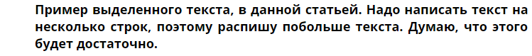
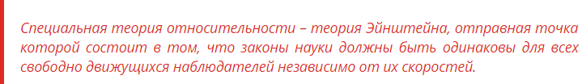
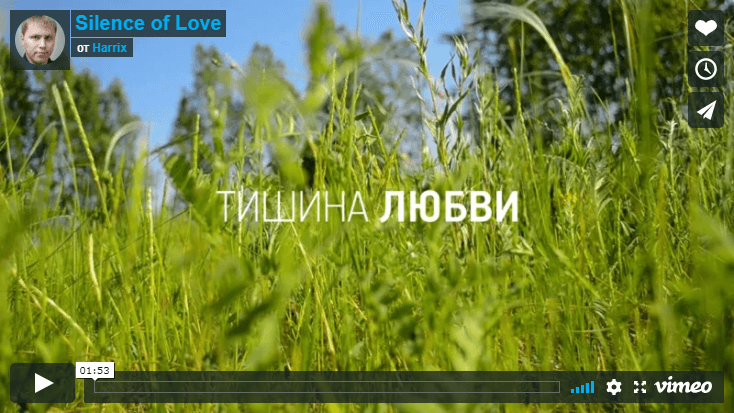
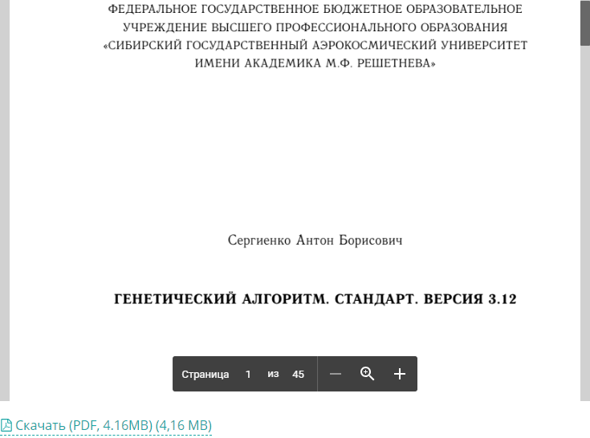
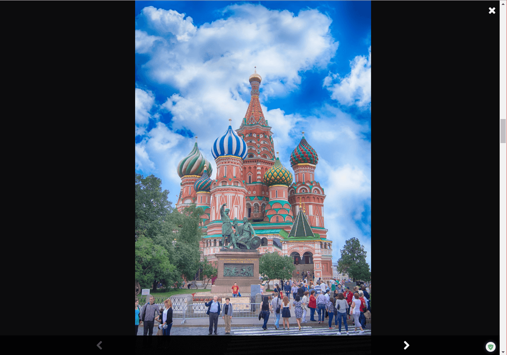
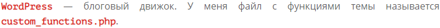
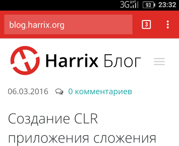

# Инструменты, использованные в блоге на Wordpress. Часть 2


Список использованных механизмов в блоге.

**Update 2018.** Статья написана была в то время, когда данный блог базировался на CMS Wordpress. Поэтому «живые» примеры заменены на скриншоты.

## Добавление своих шорткодов

В файле функций вашей темы добавьте, например, подобный код:

```php
add_filter('the_content', 'make_importanttext');
function make_importanttext($content){
  if( strpos($content, '[importanttext]')===false ) return $content;
  $tr=array(
  "[importanttext]"=>"<p class=\"importanttext\">",
  "[/importanttext]"=>"</p>",
  );
  $content=strtr($content,$tr);
  return $content;
}
```

И теперь у вас будет такой шорткод:

```html
[importanttext]Пример выделенного текста, в данной статьей. Надо написать текст на несколько строк, поэтому распишу
побольше текста. Думаю, что этого будет достаточно.[/importanttext]
```



_Рисунок 1 — Тэг importanttext_

Также в тексте данной статьи вы можете найти более сложные примеры добавления своих шорткодов.

Но лучше всего шорткоды добавлять официальным функционалом: <https://codex.wordpress.org/Shortcode_API>.

## Отображение файлов Markdown \*.md в WordPress

Читайте в [статье](https://github.com/Harrix/harrix.dev-articles-2014/blob/main/show-pdf-from-github/show-pdf-from-github.md) | [🡥](https://harrix.dev/ru/articles/2014/show-pdf-from-github/).

## Оформление цитат

Для цитат использую следующий стиль:

```css
blockquote {
  font-style: italic;
  padding: 10px 20px;
  margin: 0 0 20px;
  font-size: 17.5px;
  border-left: 5px solid #de2b26;
  color: #de2b26;
}
```



_Рисунок 2 — Оформление цитаты_

## Видео на сайте

Для отображения видео использую плагин [Responsive Video Shortcodes](https://wordpress.org/plugins/responsive-video-shortcodes/). Видео вписывается на всю ширину страницы и подгоняется под нужные размеры.

Вставляю такой код на странице:

```html
[video]https://vimeo.com/43921509[/video]
```

Получаю это (скриншот):



_Рисунок 3 — Видео на сайте_

## Для отображения содержимого документов

Чтобы показать содержимое `.doc`, `.docx`, `.xls`, `.xlsx`, `.pdf` документов на сайте, использую плагин [Google Doc Embedder](https://wordpress.org/plugins/google-document-embedder/):



_Рисунок 4 — Просмотр PDF на сайте_

## Lightbox

В качестве lightbox использую плагин [Responsive Lightbox by dFactory](https://wordpress.org/plugins/responsive-lightbox/):



_Рисунок 5 — Lightbox_

Также использую дополнительный платный аддон для этого плагина `Responsive Lightbox - PhotoSwipe`.

Вношу в файл `js/frontend.js` следующие модификации: меняю кодировку файла на UTF-8, а также в массив `options` добавляю следующий параметр:

```js
shareButtons: [
  {
    id: "vk",
    label: "Опубликовать в ВКонтакте",
    url: "http://vk.com/share.php?url={{url}}&image={{image_url}}&title={{text}}&noparse=true",
  },
  {
    id: "facebook",
    label: "Опубликовать в Facebook",
    url: "https://www.facebook.com/sharer/sharer.php?u={{url}}",
  },
  {
    id: "twitter",
    label: "Опубликовать в Twitter",
    url: "https://twitter.com/intent/tweet?text={{text}}&url={{url}}",
  },
  { id: "download", label: "Скачать", url: "{{raw_image_url}}", download: !0 },
];
```

## Комментарии

Для отражения спама используется плагин [Akismet](https://wordpress.org/plugins/akismet/), но для отображения самих комментариев использую систему `Disqus`. Регистрируйтесь на сайте [https://disqus.com](https://disqus.com/admin/), а потом устанавливайте плагин [Disqus Comment System](https://wordpress.org/plugins/disqus-comment-system/).

Внизу этой страницы можете наблюдать действие данной системы.

## Аналитика

Для добавления `Google Analytics` использую плагин [Google Analytics by Yoast](https://wordpress.org/plugins/google-analytics-for-wordpress/). Там добавляю код отслеживания Google Analytics.

## Выделение слов

Для выделения слов удобно было бы использовать просто тэг жирного текста. Но на мой взгляд, было бы более правильно выделять логические шорткоды, которые уже обрабатывать так как будет нужно. У меня для этого есть два шорткода: для названий и для имен файлов (директории):

```php
/* --------------------- Выделение важных слов --------------------- */
add_filter('the_content', 'make_important');
function make_important($content){
  if( strpos($content, '[important]')===false ) return $content;
  $tr=array(
  "[important]"=>"<span class=\"important\">",
  "[/important]"=>"</span>",
  );
  $content=strtr($content,$tr);
  return $content;
}

/* --------------------- Выделение имена файла или пути к нему --------------------- */
add_filter('the_content', 'make_filename');
function make_filename($content){
  if( strpos($content, '[filename]')===false ) return $content;
  $tr=array(
  "[filename]"=>"<span class=\"filename\">",
  "[/filename]"=>"</span>",
  );
  $content=strtr($content,$tr);
  return $content;
}
```

```css
/* «Важные» слова */
.important {
  color: #de2b26;
  font-weight: bold;
  font-family: "PT Mono", monospace;
}

/* Путь к файлу или директории */
.filename {
  color: #de2b26;
  font-weight: bold;
  font-family: "PT Mono", monospace;
}
```

Пример использования шорткодов:

```html
[important]Wordpress[/important] - блоговый движок. У меня файл с функциями темы называется
[filename]custom_functions.php[/filename].
```



_Рисунок 6 — Отображение тэгов important и filename_

## Кнопки «Скачать», «Демо», «Исходники»

По аналогии с предыдущим случаем использую шорткоды для кнопок, что в заголовке прописаны:

```php
/* --------------------- Скачать --------------------- */
add_filter('the_content', 'make_download');
function make_download($content){
  if( strpos($content, '[download]')===false ) return $content;
  $tr=array(
  "[download]"=>"<a class=\"btn btn-default\" href=\"",
  "[/download]"=>"\" target=\"_blank\">Скачать</a>",
  );
  $content=strtr($content,$tr);
  return $content;
}

/* --------------------- Демо --------------------- */
add_filter('the_content', 'make_demo');
function make_demo($content){
  if( strpos($content, '[demo]')===false ) return $content;
  $tr=array(
  "[demo]"=>"<a class=\"btn btn-default\" href=\"",
  "[/demo]"=>"\" target=\"_blank\">Демо</a>",
  );
  $content=strtr($content,$tr);
  return $content;
}

/* --------------------- Исходники --------------------- */
add_filter('the_content', 'make_source');
function make_source($content){
  if( strpos($content, '[source]')===false ) return $content;
  $tr=array(
  "[source]"=>"<a class=\"btn btn-default\" href=\"",
  "[/source]"=>"\" target=\"_blank\">Исходники</a>",
  );
  $content=strtr($content,$tr);
  return $content;
}
```

Пример применения шорткодов в тексте статьи:

```html
[demo]http://demo.harrix.org/demo0006/[/demo]
[source]http://blog.harrix.org/wp-content/uploads/2015/02/AutomaticImageMontageWithLightBox.zip[/source]
[download]http://blog.harrix.org/wp-content/uploads/2015/02/AutomaticImageMontageWithLightBox.zip[/download]
```


_Рисунок 7 — Кнопки «Скачать», «Демо», «Исходники»_

## Запрет обрамления картинок в тэг p

Мне не нравится, что изображения обрамляются абзацами. Запретим:

```php
/* --------------------- Картинки не обрамляются в p тэг --------------------- */
function filter_p_tags_on_images($content){
  return preg_replace('/<p>\s*(<a .*>)?\s*()\s*(<\/a>)?\s*<\/p>/iU', '\1\2\3', $content);
}
add_filter('the_content', 'filter_p_tags_on_images');
```

## Добавления класса картинкам в статье

Мне было нужно, чтобы все картинки в статье были с некоторым классом, например, с `a_image`:

```php
function add_class_in_images($content){
  return preg_replace('/<a (.*)>?\s*()\s*(<\/a>)?/iU', '<a class="a_image" \1>\2\3', $content);
}
add_filter('the_content', 'add_class_in_images');
```

## Favicon сайта

Сейчас просто добавить `favicon.ico` недостаточно. Поэтому я добавил множество файлов в корень сайта, которые получил через сайт <https://www.favicon-generator.org/>.

После генерации файлов и добавления в корень сайта я прописал следующее:

```php
/* --------------------- Добавляем favicon нормальный --------------------- */
add_action('wp_head','add_favicon_harrix');
function add_favicon_harrix() {
?>

<link rel="apple-touch-icon" sizes="57x57" href="/apple-icon-57x57.png">
<link rel="apple-touch-icon" sizes="60x60" href="/apple-icon-60x60.png">
<link rel="apple-touch-icon" sizes="72x72" href="/apple-icon-72x72.png">
<link rel="apple-touch-icon" sizes="76x76" href="/apple-icon-76x76.png">
<link rel="apple-touch-icon" sizes="114x114" href="/apple-icon-114x114.png">
<link rel="apple-touch-icon" sizes="120x120" href="/apple-icon-120x120.png">
<link rel="apple-touch-icon" sizes="144x144" href="/apple-icon-144x144.png">
<link rel="apple-touch-icon" sizes="152x152" href="/apple-icon-152x152.png">
<link rel="apple-touch-icon" sizes="180x180" href="/apple-icon-180x180.png">
<link rel="icon" type="image/png" sizes="192x192" href="/android-icon-192x192.png">
<link rel="icon" type="image/png" sizes="32x32" href="/favicon-32x32.png">
<link rel="icon" type="image/png" sizes="96x96" href="/favicon-96x96.png">
<link rel="icon" type="image/png" sizes="16x16" href="/favicon-16x16.png">
<link rel="manifest" href="/manifest.json">
<meta name="msapplication-TileColor" content="#ffffff">
<meta name="msapplication-TileImage" content="/ms-icon-144x144.png">
<meta name="theme-color" content="#de2b26">

<?
}
```

## Цвет вкладки на смартфонах в Chrome

В Chrome в Android смартфонах можно менять цвет вкладки на свой «фирменный цвет». За это отвечает строчка:

```html
<meta name="theme-color" content="#de2b26" />
```



_Рисунок 8 — Цвет вкладки на смартфонах в Chrome_

## Добавление еще одного файла CSS в теме

На теме, что используется в данном блоге, у меня вертится еще несколько подсайтов. Всё оформление одинаковое, но есть несколько свойств CSS уникальное для каждого подсайта (например, размеры логотипа). Поэтому, чтобы не плодить разные вариации основного CSS файла лучше создать CSS файлы, которые будут включать эти небольшие изменения. Для этого добавляем CSS файл и регистрируем его:

```css
/* --------------------- Добавляем собственный css файл для каждого подсайта, чтобы не трогать custom.css --------------------- */
add_action( 'wp_enqueue_scripts', 'harrix_add_styles' );
function harrix_add_styles()
{
  wp_enqueue_style( 'custom_own.css', get_stylesheet_directory_uri( ) . '/custom_own.css' );
}
```

## Отключаем смайлики

Не нужны мне картинки-смайлики в блоге:

```php
/* --------------------- Отключаем преобразование смайликов в WordPress --------------------- */
remove_action( 'wp_head', 'print_emoji_detection_script', 7 );
remove_action( 'admin_print_scripts', 'print_emoji_detection_script' );
remove_action( 'wp_print_styles', 'print_emoji_styles' );
remove_action( 'admin_print_styles', 'print_emoji_styles' );
```

## Удаление стилей от плагина YARPP

Плагин `Yet Another Related Posts Plugin` хорош, но он свои стили оформления он прописывает с помощью `!important`, так что приходится принудительно их отключать:

```php
/* --------------------- Удаление стилей от плагина YARPP --------------------- */
add_action( 'wp_print_styles', 'tj_deregister_yarpp_header_styles' );
function tj_deregister_yarpp_header_styles() {
  wp_dequeue_style('yarppWidgetCss');
  // Next line is required if the related.css is loaded in header when disabled in footer.
  wp_deregister_style('yarppRelatedCss');
}
add_action( 'wp_footer', 'tj_deregister_yarpp_footer_styles' );
function tj_deregister_yarpp_footer_styles() {
  wp_dequeue_style('yarppRelatedCss');
}
```

## Добавления шорткода raw

Wordpress добавляет в код статей автоформатирование. В первую очередь он разбивает текст на абзацы. Но в некоторых местах не хочется, чтобы он это делал. На текст внутри шорткода `[raw][/raw]` не будет содержать автоформатирование:

```php
/* --------------------- Добавление тэга [raw] с отсутствием автооформления --------------------- */
remove_filter('the_content', 'wpautop');
remove_filter('the_content', 'wptexturize');
add_filter('the_content', 'add_tag_raw', 99);
function add_tag_raw($content) {
  $new_content = '';
  $pattern_full = '{(\[raw\].*?\[/raw\])}is';
  $pattern_contents = '{\[raw\](.*?)\[/raw\]}is';
  $pieces = preg_split($pattern_full, $content, -1, PREG_SPLIT_DELIM_CAPTURE);

  foreach ($pieces as $piece) {
    if (preg_match($pattern_contents, $piece, $matches)) {
      $new_content .= $matches[1];
    } else {
      $new_content .= wptexturize(wpautop($piece));
    }
  }
  return $new_content;
}
```

## Добавление поиска в меню

Это уже не универсальная вещь, так как на разных темах ситуация будет разная, но вдруг наработки понадобятся:

```php
/* --------------------- Добавил поиск в пункт меню --------------------- */
add_filter('wp_nav_menu_items', 'add_search_box_to_menu', 10, 2);

function add_search_box_to_menu($items, $args) {
  if ($args - > theme_location == 'primary')
    return $items.
  "<li class='menu-item menu-item-type-custom menu-item-object-custom dropdown menu-header-search'><form action='/' id='searchform' method='get'><input   type='text' name='s' id='search_input' placeholder='&#xF002;' class='empty'></form></li>";

  return $items;
}

/* --------------------- Скрипты для работы поиска в главном меню --------------------- */
add_action('wp_head', 'add_script_search_box_to_menu');

function add_script_search_box_to_menu() { ?>

  <script type = "text/javascript">
    /* Умная функция для событий изменений размеров экрана */
    /* Иначе на мобильных устройствах слишком часто будет вызываться resize */
    (function(jQuery, sr) {

      // function from John Hann
      // http://unscriptable.com/index.php/2009/03/20/debouncing-javascript-methods/
      var debounce = function(func, threshold, execAsap) {
          var timeout;

          return function debounced() {
            var obj = this,
              args = arguments;

            function delayed() {
              if (!execAsap)
                func.apply(obj, args);
              timeout = null;
            };

            if (timeout)
              clearTimeout(timeout);
            else if (execAsap)
              func.apply(obj, args);

            timeout = setTimeout(delayed, threshold || 100);
          };
        }
        // smartresize
      jQuery.fn[sr] = function(fn) {
        return fn ? this.bind('resize', debounce(fn)) : this.trigger(sr);
      };

    })(jQuery, 'smartresize');

  /* При передаче фокуса изменяем размеры окна поиска */
  jQuery(document).ready(function() {
    jQuery('#search_input').focus(function() {
      if (jQuery(window).width() > 1024)
        jQuery('#search_input').animate({
          width: '100px'
        });
      else
        jQuery('#search_input').animate({
          width: '100%'
        });
    });
    /* Если не в фокусе поиск, а размеры изменились, то изменяем размеры поиска*/
    jQuery(window).smartresize(function() {
      if (!(jQuery('#search_input').is(':focus'))) {
        if (jQuery(window).width() > 1024) {
          jQuery('#search_input').animate({
            width: '30px'
          });
        } else
          jQuery('#search_input').animate({
            width: '100%'
          });
      }
    });
    /* Если поиск убирается, то поиск сворачиваем */
    jQuery('#search_input').blur(function() {
      if (jQuery(window).width() > 1024)
        jQuery('#search_input').animate({
          width: '30px'
        });
      else
        jQuery('#search_input').animate({
          width: '100%'
        });
    });
    /* Если что-то написали, то меняем шрифт с FontAwesome на Open sans */
    jQuery('#search_input').on('keyup', function() {
      var input = jQuery(this);
      if (input.val().length === 0) {
        input.addClass('empty');
      } else {
        input.removeClass('empty');
      }
    });
  }); </script>

  <?
}
```

## Автоматическая публикация RSS в Twitter

~~C помощью <http://feedburner.google.com/> настраиваю RSS ленту, а с помощью <http://twitterfeed.com/> настраиваю связь с Twitter.~~

**Update 2018.** Данный сервис больше не работает, и на его странице-заглушке рекомендуют использовать сервис <https://dlvrit.com/>.

## Перенаправления

Для перенаправления использую плагин [Redirection](https://wordpress.org/plugins/redirection/)
