# Как пользоваться QThread в Qt


В статье рассказывается о неправильном и более правильном способах использования механизма потоков через QThread в Qt.

<details>
<summary>📖 Содержание</summary>

## Содержание

- [Неправильный способ](#неправильный-способ)
- [Более правильный способ](#более-правильный-способ)

</details>

Потоки — удобный механизм для работы с приложением, в котором есть долго выполняемые функции, и не хотелось бы, чтобы интерфейс приложения тормозил. Разумеется, что есть еще очень много ситуаций, когда выполнение функций рекомендуется производить не в основном потоке.

## Неправильный способ

Самый простой в реализации способ — создать потомка от класса `QThread` и переопределить метод `run`. Но обратите внимание, данный способ не соответствует идеологии ООП и многие его не рекомендуют.

Создадим приложение, в котором при нажатии кнопки должна запуститься функция, которая увеличивает счетчик на 1 каждую секунду, а остальное время спит. При этом в `textEdit` выводится информация о состоянии счетчика:

```cpp
for(int i = 0; i <= 100; i++) {
  Sleep(1000);
}
```

Внешний вид приложения будет таким:

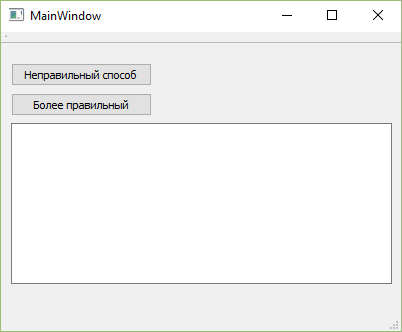

_Рисунок 1 — Внешний вид программы_

Если реализовать без дополнительного потока, то наше приложение при нажатии на кнопку просто зависнет и не будет откликаться на наши действия.

Итак, создадим новый класс MyThread.

<details>
<summary>Один из способов создания класса в Qt</summary>

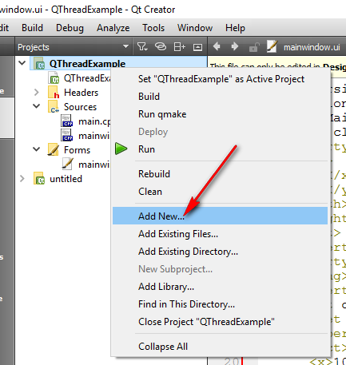

_Рисунок 2 — Выбор пункта создания нового элемента_

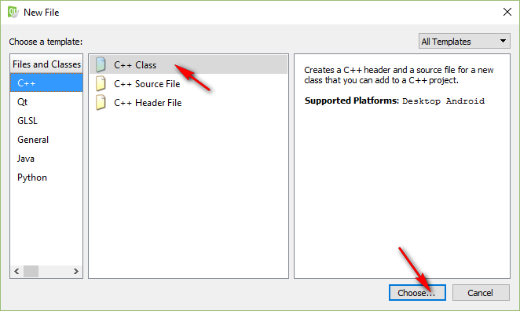

_Рисунок 3 — Выбор создания нового класса_

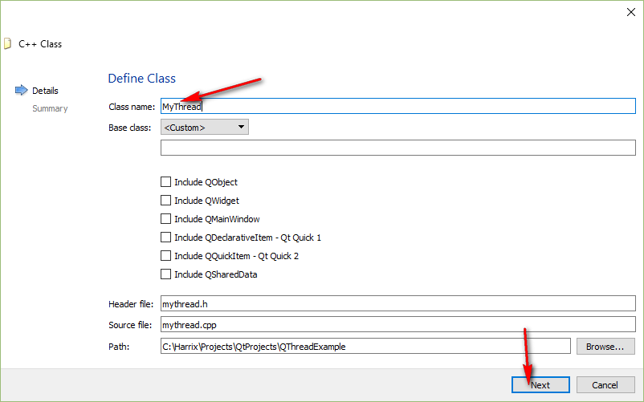

_Рисунок 4 — Ввод названия класса_

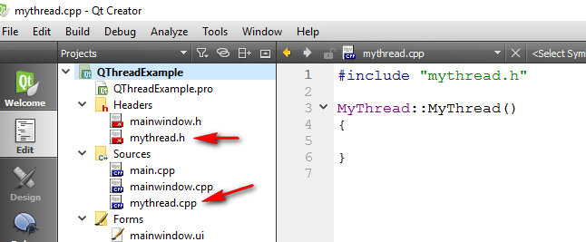

_Рисунок 5 — Файлы нового класса_

</details>

`mythread.cpp`:

```cpp
#include "mythread.h"
#include <QDebug>
#include <windows.h>

MyThread::MyThread(QString s) : name(s)
{
}

void MyThread::run()
{
  for(int i = 0; i <= 100; i++) {
    emit send(i);
    Sleep(1000);
  }
}
```

`mythread.h`:

```cpp
#ifndef MYTHREAD_H
#define MYTHREAD_H

#include <QThread>
#include <QString>

class MyThread : public QThread
{
Q_OBJECT
public:
explicit MyThread(QString s);

  void run();

signals:
  void send(int);

private:
  QString name;
};

#endif // MYTHREAD_H
```

Что у нас тут есть?

- Класс наследуется от класса `QThread`, а также обладает макросом `Q_OBJECT`. Без него не будут работать сигналы и слоты.

- Конструктор потока теперь принимает параметры, например, имя потока. Таким образом в поток можно передать нужную информацию до его запуска.

- Основная деятельность потока реализована в методе `run()`.

- У нас есть сигнал `void send(int)`, который из потока отправляется при каждом изменении счетчика `i` в методе `run()`:

```cpp
emit send(i);
```

Для того, чтобы сигнал из потока получать в главном потоке, нам нужен слот, который будет данный сигнал принимать и обрабатывать. Поэтому в `mainwindow.cpp` пропишем слот:

```cpp
void MainWindow::update (int i)
{
  ui->textEdit->insertPlainText(QString::number(i));
}
```

А в `mainwindow.h` объявим его:

```cpp
void update (int i);
```

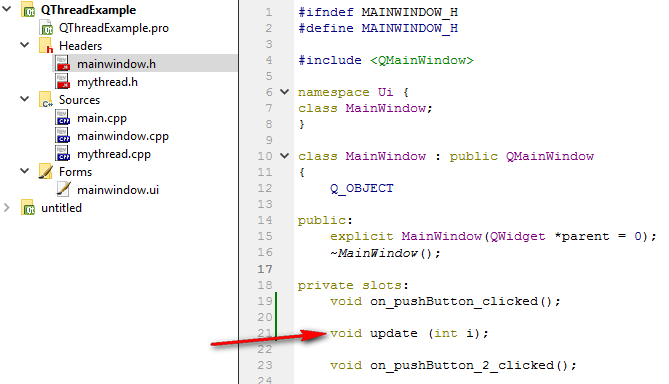

_Рисунок 6 — Метод update_

Не забудьте в `mainwindow.cpp` подключить include:

```cpp
#include "mythread.h"
```

Теперь в слоте нажатия на кнопку мы можем создать экземпляр нашего слота, соединить слот `update` и сигнал `send`, а потом уже запустить наш поток:

```cpp
void MainWindow::on_pushButton_clicked()
{
  MyThread *thread= new MyThread("A");

  connect(thread, SIGNAL(send(int)), this, SLOT(update(int)));

  thread->start();
}
```

Теперь при запуске нашей программы и нажатии на кнопку каждую секунду будет появляться значение счетчика:

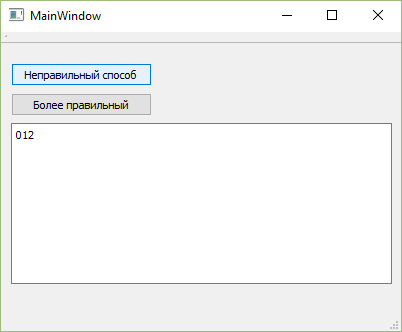

_Рисунок 7 — Результат выполнения программы_

Допустим, что вам нужно отправить некоторые данные из главного потока в новый поток, но не с помощью конструктора копии. Тогда вам нужно создать сигнал в главном потоке, а обрабатывающий его слот в новом потоке, то есть сделать всё наоборот, чем в примере выше.

В примере ниже мы добавим переменную `int globalVar` в класс, которую и поменяем из главного потока.

Обрабатывать сигнал будем слотом `receiveGlobalVar(int globalVar)`.

Модифицированные файлы:

`mythread.cpp`:

```cpp
#include "mythread.h"
#include <QDebug>
#include <windows.h>

MyThread::MyThread(QString s) : name(s)
{
}

void MyThread::run()
{
  for(int i = 0; i <= 100; i++) {
    emit send(i);
    Sleep(1000);
  }
}

void MyThread::receiveGlobalVar(int globalVar)
{
  qDebug() << "globalVar = " << globalVar;
  this->globalVar = globalVar;
}
```

`mythread.h`:

```cpp
#ifndef MYTHREAD_H
#define MYTHREAD_H

#include <QThread>
#include <QString>

class MyThread : public QThread
{
Q_OBJECT
public:
  explicit MyThread(QString s);

void run();

public slots:
  void receiveGlobalVar (int i);

signals:
  void send(int);

private:
  QString name;

  int globalVar;
};

#endif // MYTHREAD_H
```

И в `mainwindow.h` добавим сигнал:

```cpp
signals:
  void sendGlobalVar(int);
```

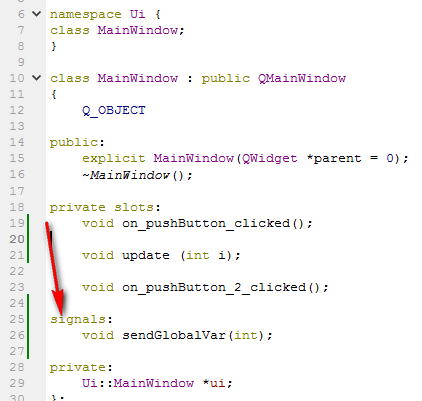

_Рисунок 8 — Сигнал sendGlobalVar_

Соединяем слот и сигнал (обратите внимание на объявление кто отправитель сигнала, а кто получатель), а потом можем сигнал отправлять:

```cpp
connect(this, SIGNAL(sendGlobalVar(int)), thread, SLOT(receiveGlobalVar(int)));
```

```cpp
emit sendGlobalVar(7);
```

Вот полный код нажатия на кнопку:

```cpp
void MainWindow::on_pushButton_clicked()
{
  MyThread *thread= new MyThread("A");

  connect(thread, SIGNAL(send(int)), this, SLOT(update(int)));
  connect(this, SIGNAL(sendGlobalVar(int)), thread, SLOT(receiveGlobalVar(int)));

  emit sendGlobalVar(7);

  thread->start();
}
```

При запуске программы и нажатии на кнопку мы увидим, что сигнал из главного потока в новый поток прошел успешно:

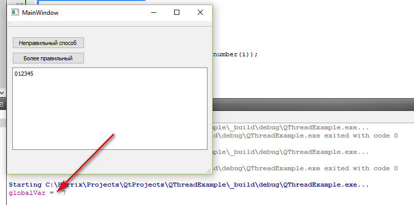

_Рисунок 9 — Результат работы программы_

## Более правильный способ

По идеи класс `QThread` не предназначен для прописывания функционала, который должен выполняться в новом потоке. Его предназначение создавать новый поток и управлять тем, что в нем происходит.

К тому же, как в примере выше, нам пришлось добавлять переменные в класс (`globalVar`), чтобы можно было получить к ним доступ из разных методов и слотов данного класса. Это всё не очень красиво и не соответствует духу ООП.

Куда правильнее будет прописать класс с нужным функционалом, создать его экземпляр и запихать его в экземпляр нового потока `QThread`. Что мы и сделаем.

Вначале создадим класс `MyClass`.

`myclass.cpp`:

```cpp
#include "myclass.h"
#include <QDebug>
#include <windows.h>

MyClass::MyClass(QString s) : name(s)
{

}

void MyClass::doWork()
{
  for(int i = 0; i <= 100; i++) {
    emit send(i);
    Sleep(1000);
  }
}
```

`myclass.h`:

```cpp
#ifndef MYCLASS_H
#define MYCLASS_H

#include <QObject>
#include <QString>

class MyClass:public QObject
{
Q_OBJECT
public:
  MyClass(QString name);

public slots:
  void doWork();

signals:
  void send(int);

private:
  QString name;
};

#endif // MYCLASS_H
```

Здесь теперь наш класс будет обладать макросом `Q_OBJECT`, а также заниматься отправкой сигналов и приемом предназначенных ему сигналов.

Основной функционал будет осуществляться в методе `doWork()`, где также как и «неправильном» методе отправляется сигнал `send()`.

В `mainwindow.cpp` мы уже не будем прописывать слот для обработки сигнала `update`, так как уже он написан для «неправильного» способа.

Так что подключим только соответствующий include:

```cpp
#include "myclass.h"
```

И в слоте нажатия второй кнопки пропишем следующий код:

```cpp
QThread *thread= new QThread;
MyClass *my = new MyClass("B");

my->moveToThread(thread);

connect(my, SIGNAL(send(int)), this, SLOT(update(int)));
connect(thread, SIGNAL(started()), my, SLOT(doWork()));

thread->start();
```

Вначале мы создали экземпляр класса `QThread` для нового потока в приложении.

Создали экземпляр нашего класса.

Потом переместили экземпляр нашего класса в новый поток.

Соединили сигнал из экземпляра класса `MyClass` и принимающего слота из главного потока.

Соединили сигнал **нового потока** о старте работы потока с методом `doWork()` класса `MyClass`, чтобы этот метод запустился при старте потока.

И потом поток запускаем:

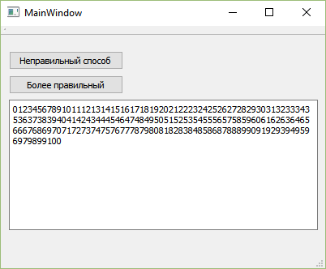

_Рисунок 10 — Результат работы программы_

Если же хотите отправить сигнал в поток из главного, то прописываем в классе MyClass соответствующий слот для принятия сигнала `receiveGlobalVar()`:

`myclass.cpp`:

```cpp
#include "myclass.h"
#include <QDebug>
#include <windows.h>

MyClass::MyClass(QString s) : name(s)
{

}

void MyClass::doWork()
{
  for(int i = 0; i <= 100; i++) {
    emit send(i);
    Sleep(1000);
  }
}

void MyClass::receiveGlobalVar(int globalVar)
{
  qDebug() << "globalVar = " << globalVar;
  this->globalVar = globalVar;
}
```

`myclass.h`:

```cpp
#ifndef MYCLASS_H
#define MYCLASS_H

#include <QObject>
#include <QString>

class MyClass:public QObject
{
Q_OBJECT
public:
  MyClass(QString name);

public slots:
  void doWork();
  void receiveGlobalVar (int i);

signals:
  void send(int);

private:
  QString name;
  int globalVar;
};

#endif // MYCLASS_H
```

`on_pushButton_2_clicked()`:

```cpp
QThread *thread= new QThread;
MyClass *my = new MyClass("B");

my->moveToThread(thread);

connect(my, SIGNAL(send(int)), this, SLOT(update(int)));
connect(thread, SIGNAL(started()), my, SLOT(doWork()));
connect(this, SIGNAL(sendGlobalVar(int)), my, SLOT(receiveGlobalVar(int)), Qt::DirectConnection);

emit sendGlobalVar(7);

thread->start();

emit sendGlobalVar(7);
```

Обратите внимание, что теперь связывать слот и сигнал желательно с параметром `Qt::DirectConnection`:

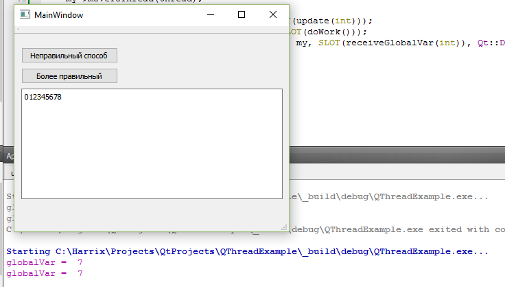

_Рисунок 11 — Результат работы программы_
