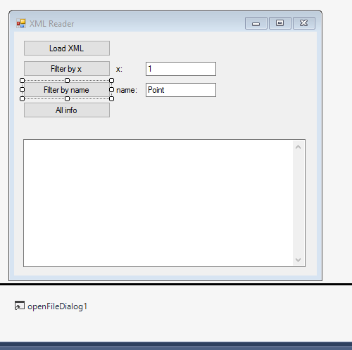
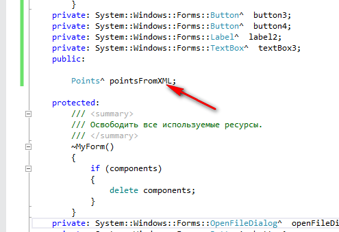
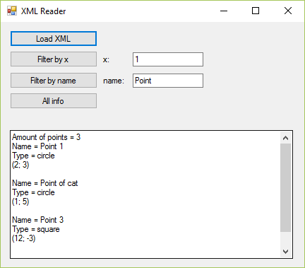

# Разбор XML файла с применением классов на C++/CLI


Продолжаем статью [Пример разбора XML файла в Visual Studio 2015 на C++](https://github.com/Harrix/harrix.dev-articles-2016/blob/main/xml-file-vs-2015/xml-file-vs-2015.md) | [↗️](https://harrix.dev/ru/articles/2016/xml-file-vs-2015/).

<details>
<summary>📖 Содержание</summary>

## Содержание

- [XML файл](#xml-файл)
- [Постановка задачи](#постановка-задачи)
- [Интерфейс программы](#интерфейс-программы)
- [Классы](#классы)
  - [Point.h](#pointh)
  - [PointWithName.h](#pointwithnameh)
  - [Points.h](#pointsh)
- [Подготовка формы](#подготовка-формы)
- [Коды кнопок](#коды-кнопок)
- [Запуск приложения](#запуск-приложения)

</details>

В статье не будет особо комментариев и подробностей ввиду определенных причин.

## XML файл

```xml
<?xml version="1.0" encoding="UTF-8" ?>
<points name="Example">
    <point type="circle">
        <x>2</x>
        <y>3</y>
    <name>Point 1</name>
    </point>
    <point type="circle">
        <x>1</x>
        <y>5</y>
    <name>Point of cat</name>
    </point>
    <point type="square">
        <x>12</x>
        <y>-3</y>
    <name>Point 3</name>
    </point>
</points>
```

## Постановка задачи

У нас должно быть три класса:

- Абстрактный класс, описывающий точку в двумерном пространстве.
- Более расширенный класс, который описывает точку с именем и типом.
- Класс, содержащий массив точек, которые считываются из XML файла.

Также кроме загрузки файла, мы должны иметь возможность обработать данные, например, отфильтровать их.

Писать будем в Visual Studio 2015 под С++/CLI приложение CLR.

## Интерфейс программы



_Рисунок 1 — Интерфейс программы_

## Классы

### Point.h

```cpp
#pragma once

using namespace System;

ref class Point {
public:
  Point();
  Point(int x, int y);
  void setX(int x);
  int getX();
  void setY(int x);
  int getY();
  virtual String^ getInfo() = 0;
protected:
  int x;
  int y;
};

Point::Point() {
  x = 0;
  y = 0;
}

Point::Point(int x, int y) {
  this->x = x;
  this->y = y;
}

void Point::setX(int x) {
  this->x = x;
}

int Point::getX() {
  return x;
}

void Point::setY(int y) {
  this->y = y;
}

int Point::getY() {
  return y;
}
```

### PointWithName.h

```cpp
#pragma once

#include "Point.h"

using namespace System;

ref class PointWithName: Point {
public:
  PointWithName();
  PointWithName(int x, int y);
  String^ getInfo() override;
  String^ getName();
  void setName(String^ name);
  String^ getType();
  void setType(String^ name);
protected:
  String^ type;
  String^ name;
};

PointWithName::PointWithName() {
  x = 0;
  y = 0;
}

PointWithName::PointWithName(int x, int y) {
  this->x = x;
  this->y = y;
}
String^ PointWithName::getInfo() {
  String^ text;

  text += "Name = " + name + "\r\n";
  text += "Type = " + type + "\r\n";
  text += "(" + Convert::ToString(x) + "; " + Convert::ToString(y) + ")\r\n";

  return text;
}

String^ PointWithName::getName() {
  return name;
}

void PointWithName::setName(String^ name) {
  this->name = name;
}

String^ PointWithName::getType() {
  return type;
}

void PointWithName::setType(String^ type) {
  this->type = type;
}
```

### Points.h

```cpp
#pragma once

#include "PointWithName.h"
#include <cliext/vector>

using namespace System;
using namespace System::Xml;
using namespace cliext;

ref class Points {
public:
  Points ();
  Points (String^ fileName);
  int size ();
  void setFileName(String^ fileName);
  PointWithName^ getElement(int i);
  String^ getInfo ();
  String^ getInfoWithFilterByX (int filter);
  String^ getInfoWithFilterByName(String^ filter);
private:
  vector<PointWithName^>^ vectorPoints;
  void readXML(String^ fileName);
};

Points::Points() {
  vectorPoints = gcnew vector<PointWithName^>();
}

Points::Points(String^ fileName) {
  vectorPoints = gcnew vector<PointWithName^>();

  readXML(fileName);
}

void Points::setFileName(String^ fileName) {
  vectorPoints->clear();

  readXML(fileName);
}

void Points::readXML(String^ fileName) {
  PointWithName^ temp;

  XmlTextReader reader(fileName);

  while (reader.ReadToFollowing("points")) {
    int pointCount = 0;

    if (reader.ReadToDescendant("point")) {
      do {
        pointCount++;

        int x, y;
        String^ type;
        String^ name;

        type = reader.GetAttribute("type");

        XmlReader^ inner = reader.ReadSubtree();

        while (inner->Read()) {
          if ((inner->Name == "x") && (inner->NodeType == XmlNodeType::Element)) {
            inner->Read();
            x = Convert::ToInt32(inner->Value);
          }
          if ((inner->Name == "y") && (inner->NodeType == XmlNodeType::Element)) {
            inner->Read();
            y = Convert::ToInt32(inner->Value);
          }
          if ((inner->Name == "name") && (inner->NodeType == XmlNodeType::Element)) {
            inner->Read();
            name = inner->Value;
          }
        }

        temp = gcnew PointWithName(x, y);
        temp->setType(type);
        temp->setName(name);

        vectorPoints->push_back(temp);

      } while (reader.ReadToNextSibling("point"));
    }
  }
}

int Points::size() {
  return vectorPoints->size();
}

PointWithName^ Points::getElement(int i) {
  return vectorPoints->at(i);
}

String^ Points::getInfo() {
  String^ info;

  for (int i = 0; i < vectorPoints->size(); i++) {
    info += "Name = " + vectorPoints->at(i)->getName() + "\r\n";
    info += "Type = " + vectorPoints->at(i)->getType() + "\r\n";
    info += "(" + vectorPoints->at(i)->getX() + "; " + vectorPoints->at(i)->getY() + ")\r\n\r\n";
  }

  return info;
}

String^ Points::getInfoWithFilterByX(int filter) {
  String^ info;

  if (vectorPoints->size() == 0)
    return "File is not loaded\r\n";

  int findCount = 0;
  for (int i = 0; i < vectorPoints->size(); i++) {
    if (vectorPoints->at(i)->getX() == filter) {
      info += "Name = " + vectorPoints->at(i)->getName() + "\r\n";
      info += "Type = " + vectorPoints->at(i)->getType() + "\r\n";
      info += "(" + vectorPoints->at(i)->getX() + "; " + vectorPoints->at(i)->getY() + ")\r\n\r\n";
      findCount++;
    }
  }

  if (findCount == 0)
    info += "Such points are not found\r\n";

  return info;
}

String^ Points::getInfoWithFilterByName(String^ filter) {
  String^ info;

  if (vectorPoints->size() == 0)
    return "File is not loaded\r\n";

  int findCount = 0;
  for (int i = 0; i < vectorPoints->size(); i++) {
    if (vectorPoints->at(i)->getName()->IndexOf(filter) >= 0) {
      info += "Name = " + vectorPoints->at(i)->getName() + "\r\n";
      info += "Type = " + vectorPoints->at(i)->getType() + "\r\n";
      info += "(" + vectorPoints->at(i)->getX() + "; " + vectorPoints->at(i)->getY() + ")\r\n\r\n";
      findCount++;
    }
  }

  if (findCount == 0)
    info += "Such points are not found\r\n";

  return info;
}
```

## Подготовка формы

В файле формы (у меня это `MyForm.h`) подключите файл третьего класса:

```cpp
#include "Points.h"
```

А в переменных формы добавьте указатель на класс `Points`:

```cpp
Points^ pointsFromXML;
```



_Рисунок 2 — Заголовочный файл_

## Коды кнопок

Кнопка `Load XML`:

```cpp
if (openFileDialog1->ShowDialog() == System::Windows::Forms::DialogResult::OK) {
  textBox2->Clear();
  String^ fileName = openFileDialog1->FileName;

  pointsFromXML = gcnew Points(fileName);

  textBox2->Text += "Amount of points = ";
  textBox2->Text += Convert::ToString(pointsFromXML->size()) + "\r\n";
  textBox2->Text += pointsFromXML->getInfo() + "\r\n";
}
```

Кнопка `Filter by x`:

```cpp
if (pointsFromXML != nullptr) {
  textBox2->Clear();
  int filter = 0;
  Int32::TryParse(textBox1->Text, filter);

  textBox2->Text += pointsFromXML->getInfoWithFilterByX(filter);
}
else
  textBox2->Text = "File is not loaded\r\n";
```

Кнопка `Filter by name`:

```cpp
if (pointsFromXML != nullptr) {
  textBox2->Clear();
  String^ filter = textBox3->Text;

  textBox2->Text += pointsFromXML->getInfoWithFilterByName(filter);
}
else
  textBox2->Text = "File is not loaded\r\n";
```

Кнопка `All info`:

```cpp
if (pointsFromXML != nullptr) {
  textBox2->Clear();

  textBox2->Text += "Amount of points = ";
  textBox2->Text += Convert::ToString(pointsFromXML->size()) + "\r\n";
  textBox2->Text += pointsFromXML->getInfo() + "\r\n";
}
else
  textBox2->Text = "File is not loaded\r\n";
```

## Запуск приложения

При запуске приложения и открытии XML файла мы можем получать информацию по точкам или их фильтровать:



_Рисунок 3 — Результат работы программы_
