# Пример разбора XML файла в Visual Studio 2015 на C++


Учебный пример для анализа XML файла. Буду рассматривать на примере визуального CLR приложения.

## Постановка задачи

Надо написать приложение, где при клике на кнопку происходит считывание информации из XML файла, его анализ и вывод информации в текстовое поле.

## Создание XML файла

Создайте текстовой файл с таким содержанием:

```xml
<?xml version="1.0" encoding="UTF-8" ?>
<points name="Example">
    <point type="circle">
        <x> 2 </x>
        <y> 3 </y>
    </point>
    <point type="circle">
        <x> 1 </x>
        <y> 5 </y>
    </point>
    <point type="square">
        <x> 12 </x>
        <y> -3 </y>
    </point>
</points>
```

И сохраните его где-нибудь как `points.xml`.

## Болванка приложения

Данная статья написана по мотивам [официальной документации](https://support.microsoft.com/ru-ru/help/815658/how-to-read-the-xml-data-from-a-file-by-using-visual-c). Так что можете обратиться к ней для получения дополнительной информации.

Итак, создайте пустое приложение CLR с формой. Это можно сделать по [статье](https://github.com/Harrix/harrix.dev-articles-2016/blob/main/add-2-num-vs-2015-clr/add-2-num-vs-2015-clr.md) <!-- https://harrix.dev/ru/articles/2016/add-2-num-vs-2015-clr/ -->, дойдя в ней до пункта «Интерфейс приложения».

## Интерфейс приложения

Перетащите на форму кнопку и текстовое поле:

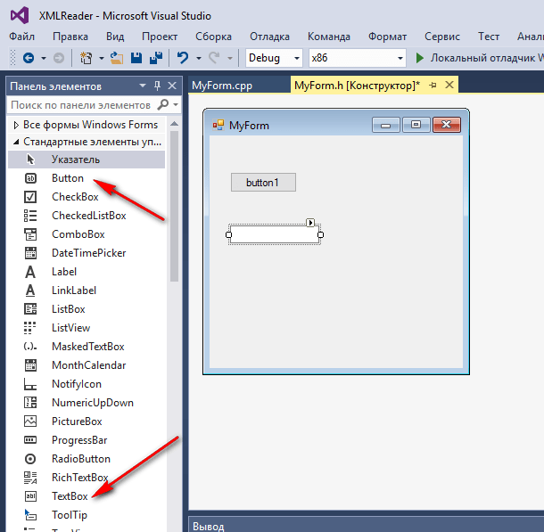

_Рисунок 1 — Компоненты на форме_

У текстового поля поменяйте параметр `MultiLine` на `true`. И увеличьте это текстовое поле:

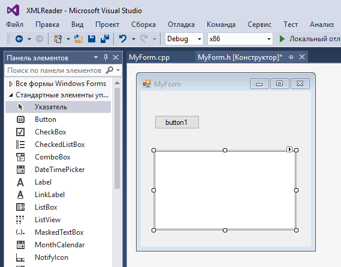

_Рисунок 2 — Увеличенное текстовое поле_

Можно добавить полосу прокрутки:

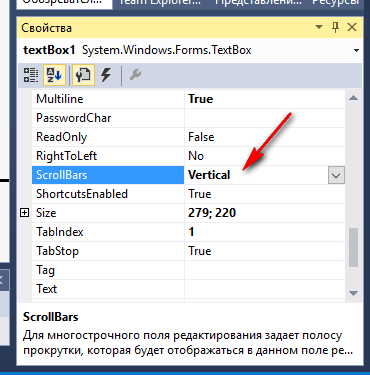

_Рисунок 3 — Полосы прокрутки на текстовом поле_

## Получение имени файла

Перетащите на форму компонент диалогового окна открытия файла:

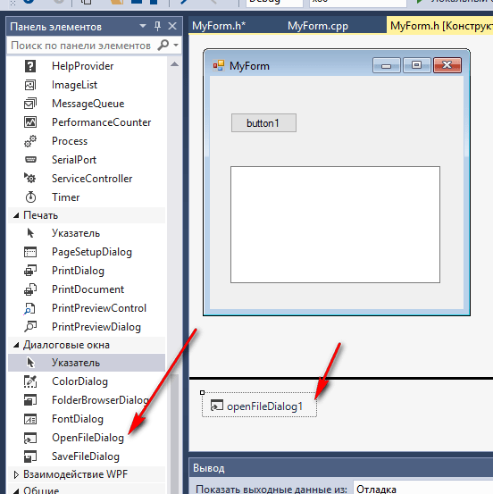

_Рисунок 4 — Компонент диалогового кона открытия файла_

Двойной клик по кнопке на форме:

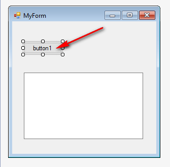

_Рисунок 5 — Двойной клик по кнопке_

При этом создается обработчик клика кнопки:

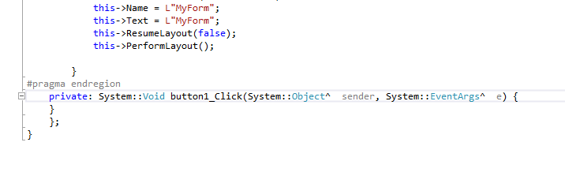

_Рисунок 6 — Обработчик клика кнопки_

В нем припишите такой код:

```cpp
if (openFileDialog1->ShowDialog() == System::Windows::Forms::DialogResult::OK)
{
    String^ fileName = openFileDialog1->FileName;

    textBox1->Text = fileName;
}
```

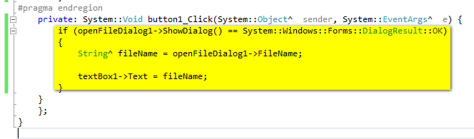

_Рисунок 7 — Код получения имени файла_

После данного приложение при запуске и клике на кнопку вызовет диалоговое окно, где вы выбираете файл. После этого в текстовом поле появится имя файла:

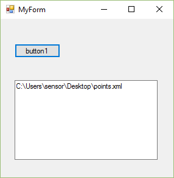

_Рисунок 8 — Результат выполнения программы_

Теперь вы научились получать имя файла через диалоговое окно. С настройками компонента разберитесь сами, если это вам нужно:

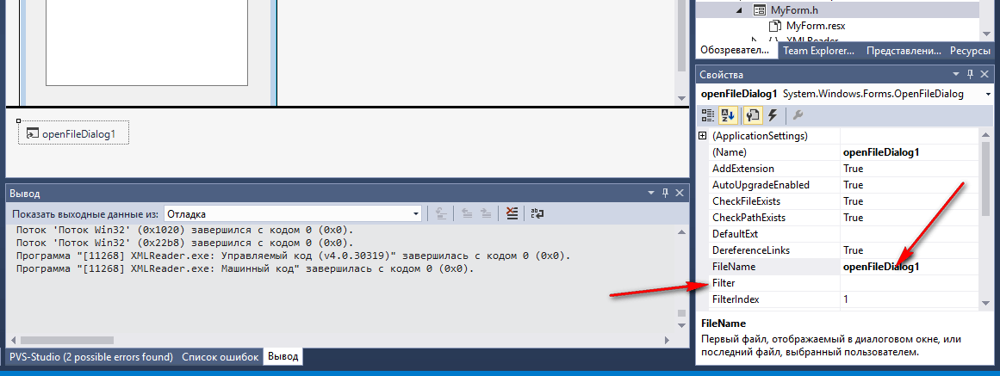

_Рисунок 9 — Настройки диалогового окна открытия файлов_

## Открытие файла

На всякий случай покажу, как загрузить из текстового файла в переменную `String`^ содержимое.

Подключите в `MyForm.h` пространство имен для работы с вводом-выводом:

```cpp
using namespace System::IO;
```

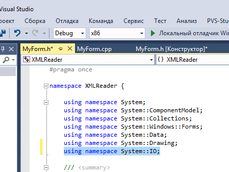

_Рисунок 10 — Подключение библиотеки System::IO_

Теперь в клике кнопки пропишем вместо прежнего кода вот такой:

```cpp
if (openFileDialog1->ShowDialog() == System::Windows::Forms::DialogResult::OK)
{
  String^ fileName = openFileDialog1->FileName;

  try
  {
    StreamReader^ din = File::OpenText(fileName);

    String^ str;
    int count = 0; // Счетчик числа строчек в файле
    while ((str = din->ReadLine()) != nullptr) // Считываем строчку из файла в str
    {
      count++;
      // Выведем новую считанную строчку в textBox1
      textBox1->Text = textBox1->Text + str + "\r\n";
    }
  }
  catch (Exception^ e)
  {
    // Если не получилось считать файл, то обрабатываем ошибки
    if (dynamic_cast<FileNotFoundException^>(e))
      textBox1->Text = "File not found";
    else
      textBox1->Text = "Problem reading file ";
  }
}
```

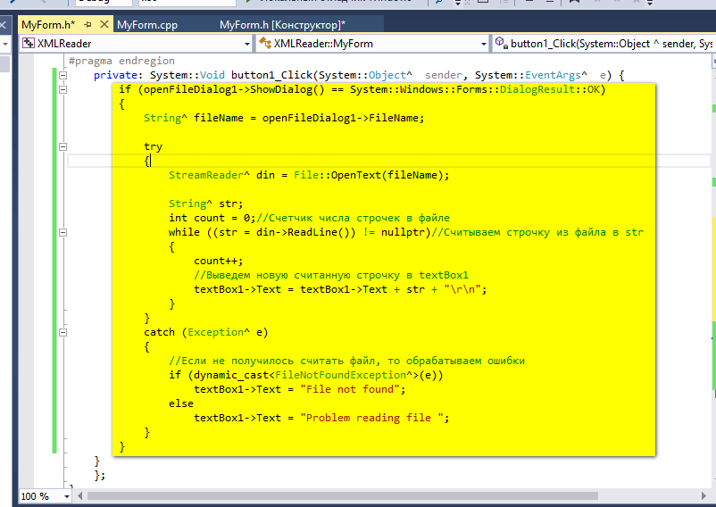

_Рисунок 11 — Код открытия файла_

Или чуть более усовершенствованный код:

```cpp
if (openFileDialog1->ShowDialog() == System::Windows::Forms::DialogResult::OK)
{
  String^ fileName = openFileDialog1->FileName;

  String^ content;

  try
  {
    StreamReader^ din = File::OpenText(fileName);

    String^ str;
    int count = 0; // Счетчик числа строчек в файле
    while ((str = din->ReadLine()) != nullptr) // Считываем строчку из файла в str
    {
      count++;
      // Выведем новую считанную строчку в content
      content += str + "\r\n";
    }

    textBox1->Text = content;
  }
  catch (Exception^ e)
  {
    // Если не получилось считать файл, то обрабатываем ошибки
    if (dynamic_cast<FileNotFoundException^>(e))
      textBox1->Text = "File not found";
    else
      textBox1->Text = "Problem reading file ";
  }
}
```

В общем, при запуске приложения теперь в текстовом поле появится содержимое файла:

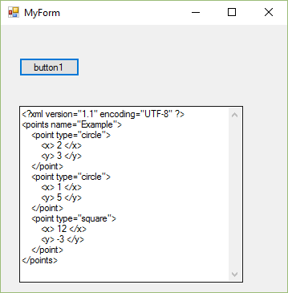

_Рисунок 12 — Результат выполнения программы_

Это можно использовать для анализа текстовых файлов, их обработки и так далее.

## Открытие и обработка именно XML файла

Но мы не будем работать напрямую с содержимым XML файла, а будем использовать специальные парсеры XML файлов.

Создайте на форме еще одну кнопку и двойным кликом создайте обработчик клика:

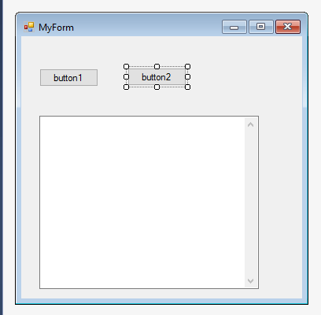

_Рисунок 13 — Вторая кнопка на форме_

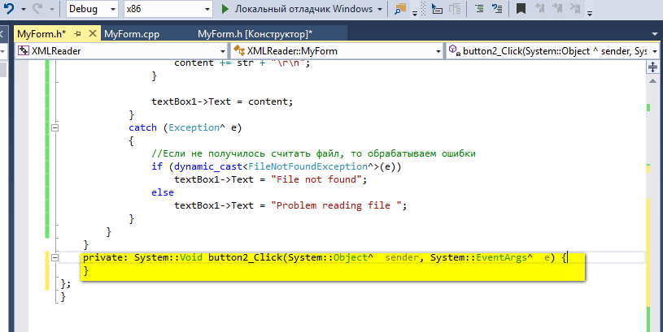

_Рисунок 14 — Обработка клика кнопки_

Подключите в `MyForm.h` пространство имен для работы с XML:

```cpp
using namespace System::Xml;
```

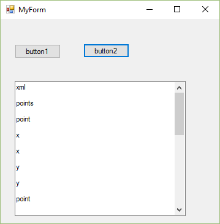

_Рисунок 15 — Подключение библиотеки System::Xml_

Пропишите там такой код:

```cpp
if (openFileDialog1->ShowDialog() == System::Windows::Forms::DialogResult::OK)
{
  String^ fileName = openFileDialog1->FileName;

  XmlTextReader reader(fileName);
}
```

Что мы тут сделали? Мы запустили диалоговое окно выбора файла, а когда он был выбран, то по выбранному файлу создали экземпляр `XmlTextReader`.

Если XML файл был корректным, то теперь в `reader` уже есть обработанные данные из XML, которые мы можем легко достать. Причем это сделать мы можем по-разному в зависимости от того, что нам нужно.

Вначале самое простое осуществим: выведем названия всех тэгов (открывающихся и закрывающихся), которые есть в нашем XML файле:

```cpp
if (openFileDialog1->ShowDialog() == System::Windows::Forms::DialogResult::OK)
{
  String^ fileName = openFileDialog1->FileName;

  XmlTextReader reader(fileName);

  while (reader.Read())
  {
    textBox1->Text += reader.Name + "\r\n";
  }
}
```


_Рисунок 16 — Вывод всех тэгов XML файла_

Хоть данный пример и бесполезен, но показывает, что наш файл обработан и с ним можно работать.

Попробуем вывести не только тэги, но и содержимое тэгов. При этом элементы будем разделять на открывающие тэги, содержимое тэгов, закрывающие тэги. И различать тэги будем через оператор [switch](https://docs.microsoft.com/en-us/cpp/cpp/switch-statement-cpp):

```cpp
if (openFileDialog1->ShowDialog() == System::Windows::Forms::DialogResult::OK)
{
  String^ fileName = openFileDialog1->FileName;

  XmlTextReader reader(fileName);

  while (reader.Read())
  {
    switch (reader.NodeType)
    {
    case XmlNodeType::Element: // The node is an element.
      textBox1->Text += "<" + reader.Name + ">\r\n";
      break;
    case XmlNodeType::Text: //Display the text in each element.
      textBox1->Text += "" + reader.Value + "\r\n";
      break;
    case XmlNodeType::EndElement: //Display the end of the element.
      textBox1->Text += "</" + reader.Name + ">\r\n";
      break;
    }
  }
}
```

Мы получили структуру нашего XML документа:

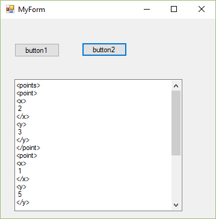

_Рисунок 17 — Структура XML файла_

На всякий случай уточняю, что тот факт, что мы выводим в `textBox1` еще и символы `<`, `</`, `>` — это только для красоты, чтобы выводимый текст был похож на XML код.

Но обратите внимание, что атрибуты тэгов мы пока не считывали. Исправим это упущение. Итак, в вышеприведенном коде мы открывающий тэг обрабатывали в следующем коде:

```cpp
case XmlNodeType::Element: // The node is an element.
    textBox1->Text += "<" + reader.Name + ">\r\n";
    break;
```

Теперь заменим его на другой, где мы еще также будем пробегать по атрибутам тэгов:

```cpp
case XmlNodeType::Element: // The node is an element.
  textBox1->Text += "<" + reader.Name + " ";
  while (reader.MoveToNextAttribute()) // Read the attributes.
    textBox1->Text += reader.Name + " = \"" + reader.Value + "\" ";
  textBox1->Text += ">\r\n";
```

То есть получим код кнопки:

```cpp
if (openFileDialog1->ShowDialog() == System::Windows::Forms::DialogResult::OK)
{
  String^ fileName = openFileDialog1->FileName;

  XmlTextReader reader(fileName);

  while (reader.Read())
  {
    switch (reader.NodeType)
    {
    case XmlNodeType::Element: // The node is an element.
      textBox1->Text += "<" + reader.Name + " ";
      while (reader.MoveToNextAttribute()) // Read the attributes.
        textBox1->Text += reader.Name + " = \"" + reader.Value + "\" ";
      textBox1->Text += ">\r\n";
      break;
    case XmlNodeType::Text: //Display the text in each element.
      textBox1->Text += "" + reader.Value + "\r\n";
      break;
    case XmlNodeType::EndElement: //Display the end of the element.
      textBox1->Text += "</" + reader.Name + ">\r\n";
      break;
    }
  }
}
```

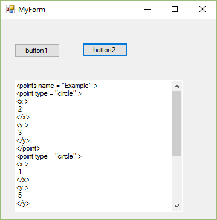

_Рисунок 18 — Вывод структуры XML файла с атрибутами_

Теперь отображаются и атрибуты. Вот таким способом вы можете пробегать по содержимому XML файла, анализировать те или иные тэги, считывать содержимое атрибутов, текста и так далее.

## Пример разбора points.xml

До этого мы рассматривали разбор любого XML файла и пытались придать внешний вид выводу в `textBox1` как у обычного XML файла. И мы предполагали, что ничего не знаем, а что конкретно хранится в файле.

Теперь же попробуем вывести информацию о точках из нашего XML файла `points.xml` зная, что за структура XML файла у нас. А у нас есть тэг `points`, внутри которого есть множество тэгов точек `point`, каждая из которых имеет в себе значения координат `x` и `y`. В общем, у нас на самом деле в XML файле хранится информация почти в табличном виде.

Вот и считаем это:

```cpp
if (openFileDialog1->ShowDialog() == System::Windows::Forms::DialogResult::OK)
{
  String^ fileName = openFileDialog1->FileName;

  XmlTextReader reader(fileName);

  // Дойдем до тэга <points>
  while (reader.ReadToFollowing("points"))
  {
    textBox1->Text += "Дошли до тэга <" + reader.Name + "> \r\n";

    int pointCount = 0; // Вдруг нам будет нужен счетчик точек. Например, для массива

    // Теперь в тэге <points> найдем все точки в виде тэгов <point>
    if (reader.ReadToDescendant("point"))
    {
      // Все тэги <point> находим в цикле
      do
      {
        pointCount++;// Увеличиваем счетчик числа найденных точек

        int x, y;
        String^ Type;

        // Считываем атрибут
        Type = reader.GetAttribute("type");

        // Внутри точки есть тэги <x> и <y>.
        // Вытащим все тэги в отдельное дерево
        XmlReader^ inner = reader.ReadSubtree();

        // И пробежимся по всем внутренностям данного поддерева точки
        while (inner->Read())
        {
          // Если текущий элемент - это открывающий тэг <x>,
          // то следующий элемент - это текст внутри тэга <x></x>
          if ((inner->Name == "x")&&(inner->NodeType == XmlNodeType::Element))
          {
            // Поэтому считываем еще один элемент и этот элемент то, что нам нужно
            inner->Read();
            x = Convert::ToInt32(inner->Value);
          }
          // Если текущий элемент - это открывающий тэг <y>,
          // то следующий элемент - это текст внутри тэга <y></y>
          if ((inner->Name == "y") && (inner->NodeType == XmlNodeType::Element))
          {
            // Поэтому считываем еще один элемент и этот элемент то, что нам нужно
            inner->Read();
            y = Convert::ToInt32(inner->Value);
          }
        }

        // Выведем считанную информацию
        textBox1->Text += "Точка №" + pointCount.ToString() + "\r\n";
        textBox1->Text += "Тип = " + Type + "\r\n";
        textBox1->Text += "x  = " + x.ToString() + "\r\n";
        textBox1->Text += "y  = " + y.ToString() + "\r\n";

      } while (reader.ReadToNextSibling("point"));
    }
  }
}
```

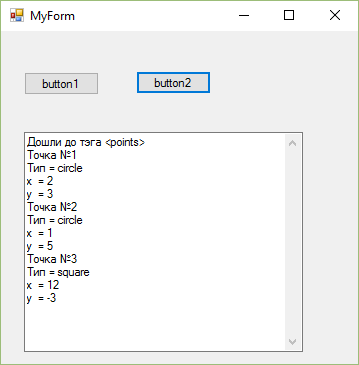

_Рисунок 19 — Результат работы программы_

Тут я использовал новые методы, такие как:

- `ReadToFollowing` — добраться до элемента с таким-то именем.
- `ReadToDescendant` — внутри элемента найти потомка с таким-то именем.
- `GetAttribute` — считать значение атрибута с таким-то именем.
- `ReadSubtree` — считать поддерево.
- `ReadToNextSibling` — перейти к следующему элементу с таким же именем (Sibling — родной брат).

## Напоследок

Выше я рассмотрел случай, когда все вычисления выполнялись внутри метода кнопки на главной форме. А конкретно данная статья в первую очередь предназначена тем, кого я попросил считывание из файла реализовать внутри отдельного класса. А из класса (в том виде, в каком я хочу увидеть) доступа к компонентам формы нет.

Как желательно реализовать логику приложения:

- Класс в качестве параметра получает имя файла в виде строчки.
- Внутри класса ничего никуда не выводится, но методы возвращают строчки с текстом, который нужно вывести.
- Диалоговое окно вызывается внутри кнопки формы.

Предвижу, что может возникнуть определенная путаница, поэтому посмотрите эту [статью](https://github.com/Harrix/harrix.dev-articles-2016/blob/main/new-class-clr-vs-2015/new-class-clr-vs-2015.md) <!-- https://harrix.dev/ru/articles/2016/new-class-clr-vs-2015/ -->.
